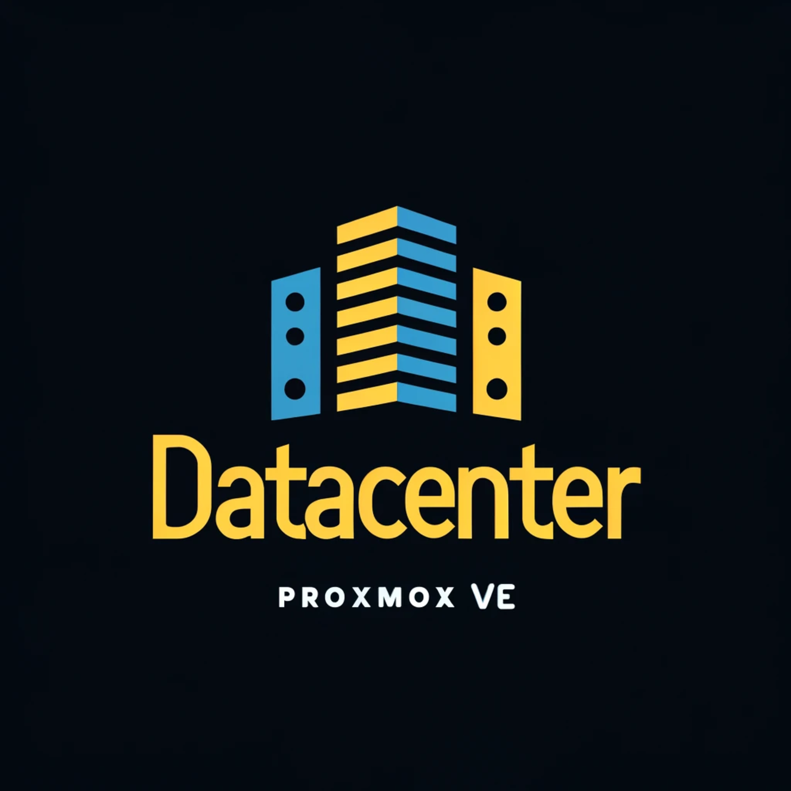

  

 

    
    
    
    
    

  # Proxmox VE Remote Data-Center (VDC)
  ## Reference Implementation

## Introduction

Would you like to deploy a Virtual Data Center (VDC) in a remote facility and work with Docker Swarm and Kubernetes (K8s)? Perhaps you need to establish development, staging, and production environments. Do you have the ability to source Metal as a Service (MaaS) or Infrastructure as a Service (IaaS) from an affordable provider? If so, this guide series is for you! It explains how to configure a VDC server capable of running enterprise workloads using Proxmox VE (PVE).

The title says "Data Center," indicating that these guides are written with the idea of clustering several computers sourced from a US-based data center located in Kansas City, MO. The hardware considered is enterprise-grade, older model systems, but they are very capable for the proposed deployment. This capability is demonstrated in the very first [**G001** guide](G001%20-%20Hardware%20Setup.md), which details the hardware setup.

You might be wondering, aren't there already guides on how to build such a system? Well, not exactly. Most guides expect you to have several computers (usually Micro PCs and Raspberry Pis for the home lab user) available to use as nodes in your Docker Swarm or Kubernetes cluster. This guide proposes one or more powerful clusters bootstrapped with a virtual environment, allowing for full enterprise-grade deployments of any workload using virtual machines and containers.

Even though the primary audience is those seeking remote, non-home-based, enterprise-grade environments, many small labs built by typical home users, developers, and IT personnel can still benefit from this guide to deploy smaller, local-based clusters.

Regarding Kubernetes, most guides you'll find on the internet use alternative tools (**k3sup** and **helm** come to mind) to handle the installation and configuration of K8s nodes. This guide emphasizes building a Kubernetes cluster from scratch, as close to the standard `kubectl` way as possible, so using those tools was avoided. However, some of those guides served as references in some cases, and you'll find some of them linked as references at the bottom of pages in this guide.

Even though Kubernetes tends to dominate in the enterprise for container orchestration Docker still has it's place in any developer stack. We will focus on deploying a Docker Swarm cluster and demonstrate the many use cases where docker can be prefered over using Kubernetes.

Standard services will be deployed in the network that you would expect to find in any data center, including web hosting, DNS, service discovery, firewalls, ingress and egress, mail, VPN, monitoring, and more.

Beyond these considerations, the information on how to perform this deployment is quite scattered on the internet. For convenience, this guide consolidates all the procedures and references in one place. Given the specificity of this build, extra steps have been taken to format the guides so they can be useful for anyone with a few spare computers who would like to do something similar.

In this guide series, **in one place**, a collection of procedures is offered to run a Proxmox VE cluster with virtual machines and containers to build a powerful enterprise-grade remote data center.

## Description of Contents

The procedures explained in this guide series mainly deal with five concepts:

- How to install and configure a virtualization platform.
- How to setup a Docker Swarm and Kubernetes cluster with VMs.
- How to deploy applications on the Docker Swarm and Kubernetes cluster.
- How to deploy multiple development Workstations for remote development.
- How to deploy other network resources using VM's and Containers.

Within these main concepts, topics like hardening, firewalling, optimizations, backups, and other relevant aspects encountered during the cluster setup are also covered.

Each guide in the series is detailed and explanatory, only omitting information when it has been covered in a previous step or guide, or when it is understood that the reader should already know about it.

Since the whole series is about building a specific setup, the guides are interrelated, more like chapters than independent guides. However, each guide usually focuses on one main concept or procedure, using the setup as an example of how to implement it.

## Intended Audience

In general, anyone with some background in Linux and virtual machines who is interested in virtualization, Docker, and Kubernetes. More broadly, anyone with the need or curiosity to run a Virtual Data Center on multiple capable enterprise-grade computers.

## Goals

The main goal of the build explained in this guide series is to combine affordable enterprise-grade computers into a virtual data center.

The core platforms used in this guide series to build the cluster are:

- Virtualization platform: [Proxmox Virtual Environment](https://www.proxmox.com/en/proxmox-virtual-environment/overview) in a clustered mode.
- Database clusters using [RonDB](https://www.rondb.com/) - [MySQL](https://www.mysql.com/) and [PostgreSQL](https://www.postgresql.org/) with virtual machines run by the Proxmox VE cluster.
- [Docker](https://www.docker.com/) engine deployed in swarm mode with virtual machines run by the Proxmox VE cluster.
- [Rancher K3s](https://k3s.io/) [Kubernetes](https://kubernetes.io/) distribution for building the Kubernetes cluster with virtual machines run by the Proxmox VE cluster.
- Hosting environment using [Virtualmin](https://www.virtualmin.com/) which will also provide other services to the network including DNS, eMail and will be deployed in virtual machines run by the Proxmox VE cluster.
- Virtual platform backups using [Proxmox Backup Server](https://www.proxmox.com/en/proxmox-backup-server/overview) installed on a dedicated node within the network.
- Mail gateway using [Proxmox Mail Gateway](https://www.proxmox.com/en/proxmox-mail-gateway/overview) installed as a virtual machine run by the Proxmox VE cluster.
- [Wireguard](https://www.wireguard.com/) technology will be used to create a management LAN between the PVE hosts to enable clustering and network management of critical PVE network functions. Multiple Wiregaurd networks will be deployed.

Other platfroms and concepts will be demonstrated including:
- Setting up multiple Development Workstations i.e. [MacOS](https://www.apple.com/macos/sonoma/), [Windows](https://www.microsoft.com/en-us/windows/windows-11?r=1), [Ubuntu](https://ubuntu.com/desktop) desktops for remote development support.
- Monitoring tools i.e. [Prometheus](https://prometheus.io/), [Grafana](https://grafana.com/grafana/), and [Zabbix](https://www.zabbix.com/) for monitoring network and cluster services.
- Most Physical Servers and VM's in the network with the exception of the PVE nodes will be setup with [Webmin](https://webmin.com/) to allow for web-based system administration of the servers and VM's as an alternative to using SSH and editing config files.

After setting up the Docker Swarm cluster, the idea is to deploy in it the following.

- TBD - To be determined

After setting up the Kubernetes cluster, the idea is to deploy in it the following.

- TBD - To be determined

The whole system will also have backup procedures applied to it.

## Acknowledgements
This project was forked from the [smallab-k8s-pve-guide](https://github.com/ehlesp/smallab-k8s-pve-guide) by [ehlesp](https://github.com/ehlesp). Significant modifications and extensions have been made to adapt it for the specific needs of this project. Special thanks to the original author for their valuable work.

## Table of Contents

All the guides and their main sections are easily accessible through the [Table of Contents](G000%20-%20Table%20of%20Contents.md) of this guide series.

## Navigation

[+Table of Contents+](G000%20-%20Table%20of%20Contents.md) | [Next (**G001. Hardware Setup**) >>](G001%20-%20Hardware%20Setup.md)
