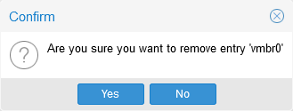
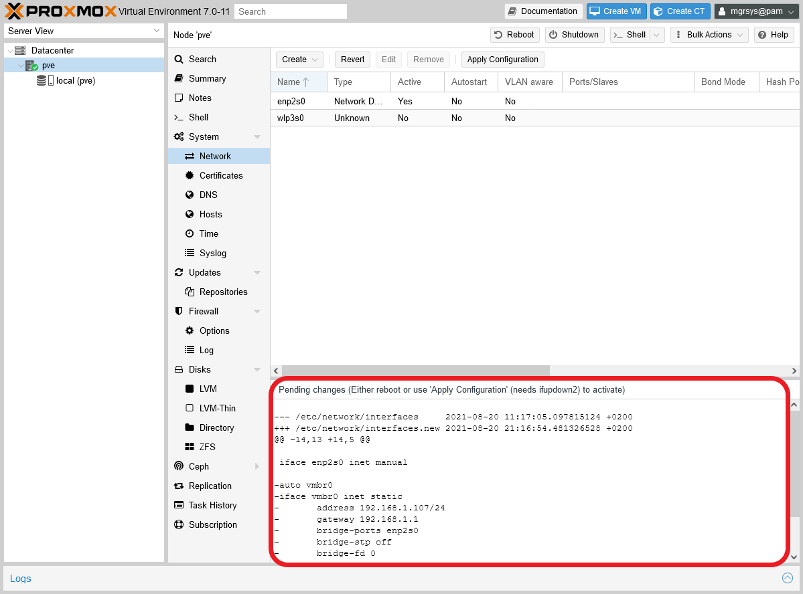
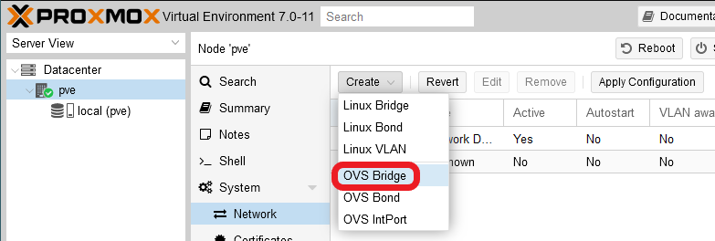
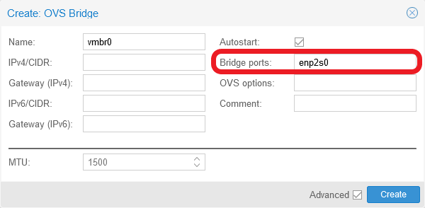
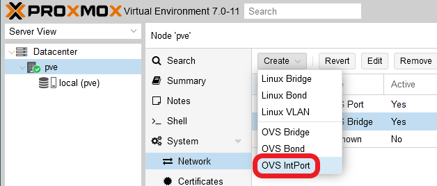
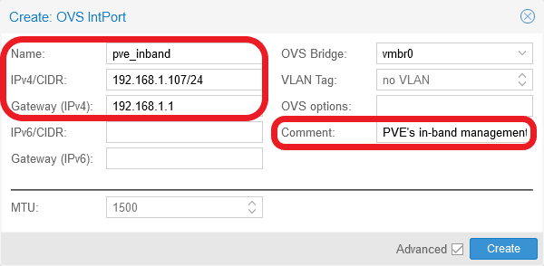

# G910 - Appendix 10 ~ Setting up virtual network with Open vSwitch

Proxmox VE uses Linux bridge technology by default to set up the virtual network, but it also supports **Open vSwitch** (also known as **OVS**). Here I'll show you how to install OVS and replace the default bridge with an OVS one.

## Installation

Open a shell in your Proxmox VE system as `mgrsys` and then execute:

~~~bash
$ sudo apt install -y openvswitch-switch
~~~

After the installation, OVS will have two daemons running: `ovs-vswitchd` and `ovsdb-server`. Check them out with `htop`, noticing also the increase in RAM usage. These services won't do anything to your network on their own: you have to setup OVS explicitly.

## Replacing the Linux bridge with the OVS one

Log in the PVE web console and go to the `System > Network` tab of your `pve` node.

In the capture above you can see the initial setup on my PVE host, which I already explained (and reconfigured) in the [G017 guide](G017%20-%20Virtual%20Networking%20~%20Network%20configuration.md).

### _Backing up the current network interfaces configuration_

Before going forward with the new OVS-based configuration, make a backup of your current network intefaces setup. To do so, open a shell on your PVE host with your `mgrsys` user and do the following.

~~~bash
$ sudo cp /etc/network/interfaces /etc/network/interfaces.bkp
~~~

### _Setting up the OVS bridge_

Go back to the web console and, again, in the `System > Network` screen of your PVE node do the following.

1. Select the `vmbr0` interface and click on the `Remove` button.

    

    The web console will ask for your confirmation.

    

2. The `vmbr0` interface should disappear from the list and a `Pending changes` read-only diff console will appear below.

    

    The diff console shows you how the affected configuration files are going to be modified with the change. In this case, only the `/etc/network/interfaces` file is affected by this reconfiguration.

    > **BEWARE!**  
    > Don't click on the `Apply Configuration` button or reboot just yet! Wait till you've created and set your new OVS bridge up completely!

3. Now click on the `Create` button and select `OVS Bridge` from the list.

    

4. In the resulting window, just fill the `Bridge ports` field with the name of your main real and active network interface.

    

    In my case it's the `enp2s0` interface, as it was for the removed Linux bridge. After clicking `Create`, you should see the new bridge appearing in the interfaces list.

    

5. The OVS bridge is created but lacks an in-band interface to have access to the Proxmox VE host itself. So, to create an OVS InPort for in-band management, click on `Create` and choose `OVS IntPort`.

    

6. In the new window, you'll have to fill up the `Name`, `IPv4/CIDR` and `Gateway (IPv4)` fields to set up your in-band.

    

    Regarding the relevant fields at this step.

    - `Name` : can be any strictly alphanumerical (only '`a-z`', '`_`' and '`0-9`' are admitted) lower-cased string between 2 and 21 characters.
    - `IPv4/CIDR` : this is were you input the IP of your host, plus the subnet mask (`/24` in my case). In other words, it's just the same IP you had in the previously removed Linux bridge.
    - `Gateway (IPv4)` : the IP of your network's gateway, which could be your home router.
    - `OVS Bridge` : to indicate to which bridge this IntPort has to be connected to. By default you'll have this field filled by the name of the only one OVS bridge you have now.
    - `Comment` : any string you might like to leave here.

    After filling the proper fields, click on `Create`, and find your new OVS IntPort in the interfaces list.

    

    Notice that it's not `Active` yet, and that it has been added to the `Ports/Slaves` list of your new `vmbr0` OVS Bridge.

7. To organize (or partition) the traffic among your VMs and containers better, you can create VLANs. To create an VLAN, click on `Create`, choose `OVS IntPort` like you did for the in-band interface, and fill the form like below.

    

    You can type anything as the `Name`, but make it meaningful and don't use anything beyond alphanumeric characters. The `VLAN Tag` can only be a number, so just put any you prefer there between 1 and 4096. Click on `Create` after you've filled those values. In my case, I've created two VLANs that also have been automatically added as `Ports/Slaves` to the `vmbr0` OVS bridge.

    

8. Now that you have everything ready, you can hit the `Apply Configuration` button.

    

    It will ask for your confirmation.

    

9. After applying the new configuration, you should see the in-band port and the vlans active in your `Network` screen.

    

    Also, with `htop` you'll see how, under the `ovs-vswitchd` daemon process, there are now several threads or subprocesses running.

    

## Relevant system paths

### _Directories_

- `/etc/network`

### _Files_

- `/etc/network/interfaces`
- `/etc/network/interfaces.bkp`

## References

### _Virtual networking with Open vSwitch (OVS)_

- [Open vSwitch](https://www.openvswitch.org/)
- [Open vSwitch in Proxmox VE wiki](https://pve.proxmox.com/wiki/Open_vSwitch)
- [Proxmox VE with Open vSwitch](https://www.networkshinobi.com/proxmox-ve-with-open-vswitch/)
- [Proxmox – KimSufi, OVH, SoYouStart – IPv6 – Host Multiple Containers and Virtual Machines on a Single KimSufi Server using IPv6 and ProxMox](https://www.kiloroot.com/proxmox-kimsufi-ovh-soyoustart-ipv6-host-multiple-containers-and-virtual-machines-on-a-single-kimsufi-server-using-ipv6-and-proxmox/)

## Navigation

[<< Previous (**G909. Appendix 09**)](G909%20-%20Appendix%2009%20~%20Kubernetes%20object%20stuck%20in%20Terminating%20state.md) | [+Table Of Contents+](G000%20-%20Table%20Of%20Contents.md) | [Next (**G911. Appendix 11**) >>](G911%20-%20Appendix%2011%20~%20Alternative%20Nextcloud%20web%20server%20setups.md)
